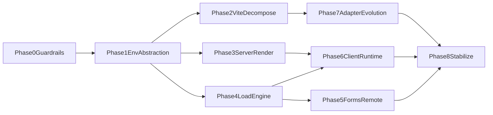

# SvelteKit Rewrite Roadmap (Svelte 5 + Vite Environments)

## Scope and Design Targets

- Rebuild SvelteKit’s runtime/build core around Svelte 5 semantics (`$props`, runes, async SSR, `hydratable`, `<svelte:boundary>`) and Vite’s multi-environment model.
- Keep user-facing behavior stable.
- Prefer an incremental “strangler” rewrite over a big-bang replacement so tests, adapters, and docs stay green throughout.

## What to Keep vs Rewrite

### Keep (high ROI, low conceptual churn)

- Route grammar and matching core: `[c:/repos/svelte/svelte-kit/packages/kit/src/utils/routing.js](c:/repos/svelte/svelte-kit/packages/kit/src/utils/routing.js)`
- Manifest/type generation pipeline (concept + much implementation): `[c:/repos/svelte/svelte-kit/packages/kit/src/core/sync/create_manifest_data](c:/repos/svelte/svelte-kit/packages/kit/src/core/sync/create_manifest_data)`, `[c:/repos/svelte/svelte-kit/packages/kit/src/core/sync/write_types](c:/repos/svelte/svelte-kit/packages/kit/src/core/sync/write_types)`
- Adapter contract shape (extend, don’t replace): `[c:/repos/svelte/svelte-kit/packages/kit/src/core/adapt](c:/repos/svelte/svelte-kit/packages/kit/src/core/adapt)`
- Env module taxonomy (`$env/static|dynamic`, public/private) and docs model: `[c:/repos/svelte/svelte-kit/documentation/docs/98-reference/25-$env-static-private.md](c:/repos/svelte/svelte-kit/documentation/docs/98-reference/25-$env-static-private.md)`

### Rewrite (core technical debt / new platform assumptions)

- Monolithic Vite integration into environment-aware plugins: `[c:/repos/svelte/svelte-kit/packages/kit/src/exports/vite/index.js](c:/repos/svelte/svelte-kit/packages/kit/src/exports/vite/index.js)`
- SSR/rendering pipeline for async `render(...)`, `hydratable`, boundary error transform wiring: `[c:/repos/svelte/svelte-kit/packages/kit/src/runtime/server/page/render.js](c:/repos/svelte/svelte-kit/packages/kit/src/runtime/server/page/render.js)`
- Load orchestration + invalidation semantics: `[c:/repos/svelte/svelte-kit/packages/kit/src/runtime/server/page/load_data.js](c:/repos/svelte/svelte-kit/packages/kit/src/runtime/server/page/load_data.js)`, `[c:/repos/svelte/svelte-kit/documentation/docs/20-core-concepts/20-load.md](c:/repos/svelte/svelte-kit/documentation/docs/20-core-concepts/20-load.md)`
- Forms/remote form internals split and simplification: `[c:/repos/svelte/svelte-kit/packages/kit/src/runtime/form-utils.js](c:/repos/svelte/svelte-kit/packages/kit/src/runtime/form-utils.js)`, `[c:/repos/svelte/svelte-kit/documentation/docs/20-core-concepts/30-form-actions.md](c:/repos/svelte/svelte-kit/documentation/docs/20-core-concepts/30-form-actions.md)`, `[c:/repos/svelte/svelte-kit/documentation/docs/20-core-concepts/60-remote-functions.md](c:/repos/svelte/svelte-kit/documentation/docs/20-core-concepts/60-remote-functions.md)`
- Client router/runtime state transitions to align with Svelte 5 async + boundary behavior: `[c:/repos/svelte/svelte-kit/packages/kit/src/runtime/client/client.js](c:/repos/svelte/svelte-kit/packages/kit/src/runtime/client/client.js)`

## Critical Compatibility Constraints

- Public API must remain unchanged for stable, documented surfaces (runtime APIs, configuration, route conventions, and adapter-facing contracts), except behind explicitly opt-in experimental flags.
- All existing end-to-end test suites must pass before any default switch or stabilization milestone is complete.
- Unit tests may be rewritten only when internals are intentionally restructured; behavioral intent must remain equivalent and covered by parity assertions.
- Svelte 5 component/runtime model: `[c:/repos/svelte/svelte/documentation/docs/07-misc/07-v5-migration-guide.md](c:/repos/svelte/svelte/documentation/docs/07-misc/07-v5-migration-guide.md)`
- Hydration data stability and CSP behavior with `hydratable`: `[c:/repos/svelte/svelte/documentation/docs/06-runtime/05-hydratable.md](c:/repos/svelte/svelte/documentation/docs/06-runtime/05-hydratable.md)`
- Boundary error behavior and `transformError`: `[c:/repos/svelte/svelte/documentation/docs/05-special-elements/01-svelte-boundary.md](c:/repos/svelte/svelte/documentation/docs/05-special-elements/01-svelte-boundary.md)`
- Vite environment model (client + multiple server-like environments): [Vite Environment API](https://vite.dev/guide/api-environment)

## Incremental Execution Plan

### Phase 0 — Architecture Baseline and Guardrails

- Define rewrite invariants: route resolution determinism, load invalidation rules, adapter API compatibility, progressive enhancement behavior.
- Add API contract checks for public surfaces to detect accidental breaking changes during the rewrite.
- Add architecture decision records for environment model, rendering contracts, and migration flags.
- Freeze a baseline conformance suite from existing integration/unit tests to measure parity, with existing e2e suites as mandatory pass gates.

### Phase 1 — Introduce Environment Abstraction (No behavior change)

- Add an internal `RuntimeEnvironment` abstraction (`client`, `ssr`, `edge`, `worker`, extensible).
- Replace direct boolean `ssr` branching in Vite plugin internals with environment-aware helpers.
- Keep legacy behavior via compatibility adapters (`ssr`/`client` default mapping).

### Phase 2 — Decompose Vite Plugin by Concern

- Split `exports/vite/index.js` into smaller plugins/modules:
  - environment resolution
  - virtual modules (`$env`, `$app/*`, remote stubs)
  - build orchestration
  - guardrails/server-only checks
- Introduce per-environment build output planning and manifest stitching.

### Phase 3 — Rewrite Server Rendering Pipeline

- Replace monolithic page render path with composable pipeline stages:
  - request context + route selection
  - load execution + dependency graph
  - Svelte async render orchestration (`render` contract)
  - CSP/hydratable serialization merge
  - boundary/error transformation (`handleError` + boundary-safe payload)
- Ensure hydration comments and serialized payload are preserved end-to-end.

### Phase 4 — Rewrite Load Engine and Invalidation

- Model load as explicit DAG with parent-child data contract and dependency tracking.
- Reimplement invalidation triggers (`params`, `url.searchParams`, explicit `depends`, manual invalidation).
- Align server/universal load reconciliation with streaming/async updates and remote-query semantics.

### Phase 5 — Forms + Remote Functions Core Split

- Extract transport/serialization primitives from `form-utils` into isolated modules.
- Unify classic actions and remote forms around shared mutation lifecycle APIs.
- Implement explicit reset/clear semantics and preflight ordering guarantees in one state machine.

### Phase 6 — Client Runtime Rebuild

- Rework client navigation engine around Svelte 5 async rendering and boundary-aware transitions.
- Introduce cancellable navigation/load tasks with deterministic race handling.
- Preserve progressive enhancement and accessibility guarantees (focus/reset semantics).

### Phase 7 — Adapter and Build Output Evolution

- Extend (not break) adapter builder APIs for multi-environment outputs.
- Keep current adapters functional via shim layer; migrate first-party adapters one-by-one.
- Add environment capabilities metadata to adapter contract.

### Phase 8 — Migration + Stabilization

- Ship behind experimental flag first; dual path old/new runtime in CI.
- Expand docs/migrations for app authors and adapter authors.
- Flip default only after conformance, perf, and ecosystem adapter readiness gates.

## Parallelization Plan

Parallel tracks after Phase 1:

- Track A: Vite/environment plumbing (Phases 2 + 7)
- Track B: Runtime semantics (Phases 3 + 4 + 6)
- Track C: Mutation stack (Phase 5)
- Track D: Test/docs/migration authoring (continuous from Phase 0)

### Subagent Execution Requirement (for each parallel track)

- For each track entry above, execute a two-stage subagent workflow:
  - Stage A (planning): run a dedicated subagent to produce a detailed, file-level implementation plan with dependencies, risks, and test strategy for that track.
  - Stage B (implementation): run a dedicated subagent to implement the approved Stage A plan for that track.
- Do not start Stage B for a track until its Stage A plan is complete and accepted.
- Keep track outputs scoped (A/B/C/D) and merge in dependency order from the mermaid graph.
- Each implementation-stage subagent must report:
  - files changed
  - tests executed (including e2e impact)
  - public API compatibility check results

## Small, Actionable Task Backlog (First 6–8 Weeks)

- Define environment abstraction types + compatibility wrappers.
- Add environment-aware module-graph/loading helper and migrate callers.
- Split Vite plugin file physically (no behavior changes).
- Build render pipeline interfaces and move existing logic behind them.
- Carve out load dependency tracker module with golden tests.
- Extract form serialization primitives from `form-utils`.
- Build unified mutation lifecycle API used by actions + remote forms.
- Add boundary/transformError integration tests for SSR + hydration.
- Add dual-runtime CI matrix (legacy vs rewrite flag).
- Draft migration docs for framework users and adapter maintainers.

## Exit Criteria per Major Milestone

- Phase 2 done: no direct `options?.ssr` branching in new plugin internals.
- Phase 4 done: load invalidation parity against current docs + tests.
- Phase 6 done: navigation race/cancel semantics proven by deterministic tests.
- Phase 8 done: default flip gated by zero public API regressions, full e2e pass, perf non-regression, adapter readiness, and test parity.

